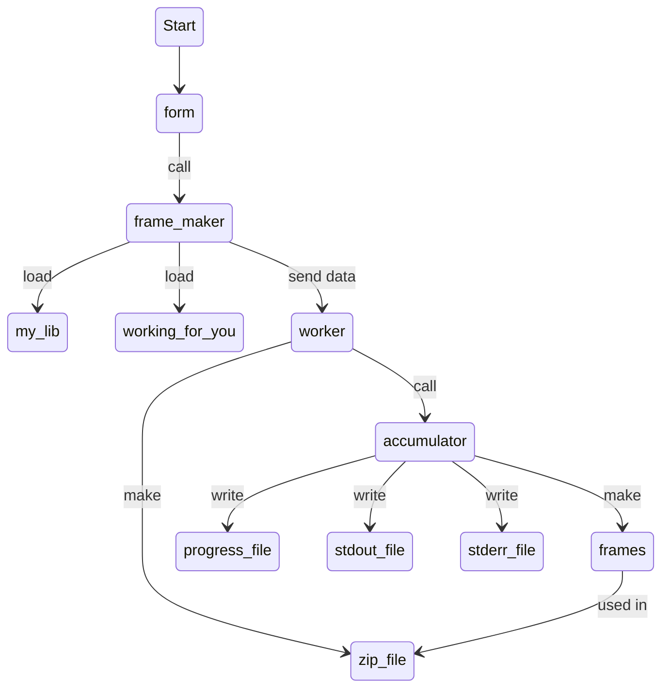

```mermaid
stateDiagram-v2 
    Start-->form
    form --> frame_maker : call
    frame_maker --> my_lib : load
    frame_maker --> working_for_you : load
    frame_maker --> worker : send data
    worker      --> accumulator : call
    worker      --> zip_file : make
    accumulator --> frames : make
    frames      --> zip_file : used in
    accumulator --> progress_file : write
    accumulator --> stdout_file : write
    accumulator --> stderr_file : write
```
