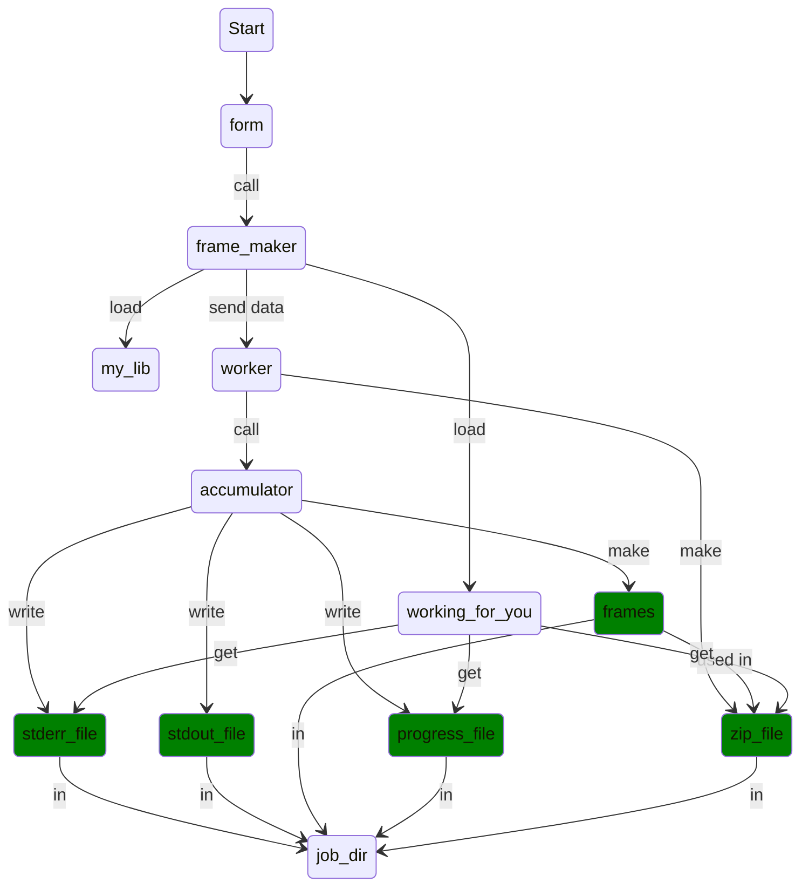

```mermaid
stateDiagram-v2
    classDef job_specific fill:green 

    Start-->form
    form --> frame_maker : call
    frame_maker --> my_lib : load
    frame_maker --> working_for_you : load
    frame_maker --> worker : send data
    worker      --> accumulator : call
    worker      --> zip_file : make
    accumulator --> frames : make
    frames      --> zip_file : used in
    accumulator --> progress_file : write
    accumulator --> stdout_file : write
    accumulator --> stderr_file : write
    stderr_file --> job_dir : in
    stdout_file --> job_dir : in
    frames      --> job_dir : in
    progress_file --> job_dir : in
    zip_file    --> job_dir : in
    working_for_you --> stderr_file : get
    working_for_you --> progress_file : get
    working_for_you --> zip_file : get

    class zip_file job_specific
    class frames   job_specific
    class progress_file job_specific
    class stderr_file job_specific
    class stdout_file job_specific
```
