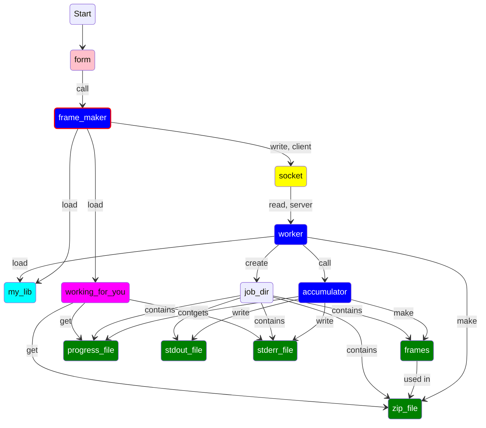

We need
* A directory for html files (in web tree)
* A directory for cgi (in web tree)
* A directory for other executable (outside)
* A directory for "libraries" (Ruby libs and templates, outside)
* A location for the socket  (outside)
* A directory for job dirs (outside)
* httpd stuff (use the default)

