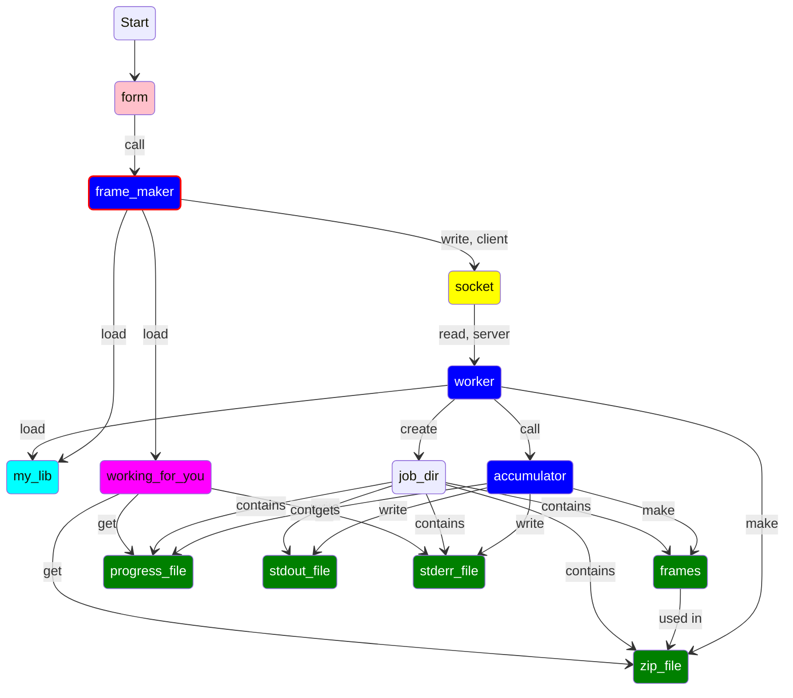

# What is this?

This mess contains resources to create Docker files that allows to
use our reconstructor via a web server.

# How does it work?

Roughly, like this

1. The user loads `index.html` which displays a form with the reconstruction parameters and allows the user to upload the event file
2. The data submitted by the user are given, on the server side, to a CGI script **frame_maker.rb** which parses the data and prepare it for the reconstruction process
3. The script frame_maker.rb sends back an HTML file obtained by template expanding **working-for-you.thtml**
4. frame_maker.rb starts the reconstruction process by passing the parsed data to **worker.rb**
5. **worker.rb** is a background process that works as follos
   a. Listen on an internal socket, waiting for a connection from `frame_maker`
   b. Read the parameters from the socket
   c. Run `accumulator` using the parameters received via the socket
   d. Wait for `accumulator` to complete, then collect the generated files in a zip archive
   e. Do some cleanup and go back to listening
6. `frame_maker` provides to `worker` few paths like the files to be used as `stdout` and `stderr`, the directory where the frames are saved and the file to be used to store the current advancement
7. `accumulator` write the percentage of work done in a file provided by `frame_maker` via `worker`
8. The HTML file sent back by `frame_maker` has some JavaScript code that periodically poll the progress file and update the percentage of work done in the GUI.  When the zip archive is ready, it enables its download
9. `worker` is run by the shell script `worker-manager.sh` which restarts `worker` if it crashes

This apparently complex structure is necessary since `frame_maker` cannot wait for `accumulaltor` to finish.  It is necessary to wait for the completion of `accumulator` in order to collect the generated frames in a zip file.  Therefore, `accumulator` is run in the background, with another process (`worker`) with the duty of waiting for it and prepare the zip file.

We need

| What | Where |
|------|-------|
| A directory for html files | $root/htdocs |  
| A directory for cgi | $root/cgi-bin |  
| A directory for other executable | $root/lib |  
| A directory for "libraries" (ruby and templates)  | $root/lib | 
| A location for the socket  | $root/lib/worker | 
| A directory for job dirs | $root/jobs |
| httpd stuff | use the default| 

where $root is ServerRoot in the httpd.conf file
