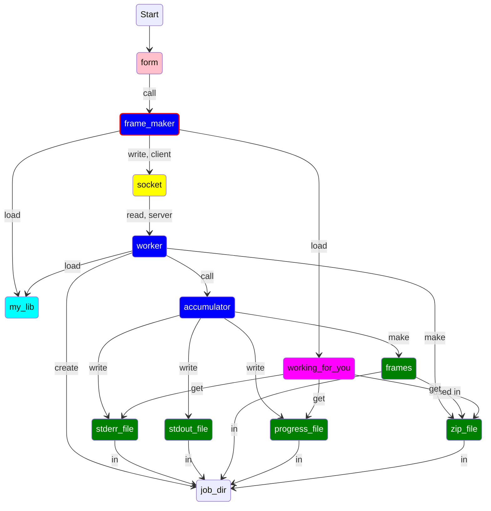

```mermaid
stateDiagram-v2
    classDef job_specific fill:green,color:white 
    classDef html fill:pink 
    classDef template fill:magenta 
    classDef executable fill:blue,color:white  
    classDef cgi fill:blue,color:white,border-color:red,stroke-width:2px,stroke:red
    classDef library fill:cyan
    classDef socket  fill:yellow 

    Start-->form
    form --> frame_maker : call
    frame_maker --> my_lib : load
    frame_maker --> working_for_you : load
    frame_maker --> socket : write, client
    socket      --> worker : read, server
    worker      --> accumulator : call
    worker      --> zip_file : make
    worker      --> my_lib : load
    worker      --> job_dir : create
    accumulator --> frames : make
    frames      --> zip_file : used in
    accumulator --> progress_file : write
    accumulator --> stdout_file : write
    accumulator --> stderr_file : write
    stderr_file --> job_dir : in
    stdout_file --> job_dir : in
    frames      --> job_dir : in
    progress_file --> job_dir : in
    zip_file    --> job_dir : in
    working_for_you --> stderr_file : get
    working_for_you --> progress_file : get
    working_for_you --> zip_file : get

    class worker executable
    class accumulator executable
    class working_for_you template
    class form            html
    class zip_file job_specific
    class frames   job_specific
    class frame_maker cgi
    class progress_file job_specific
    class stderr_file job_specific
    class stdout_file job_specific
    class my_lib library
    class socket socket
```
